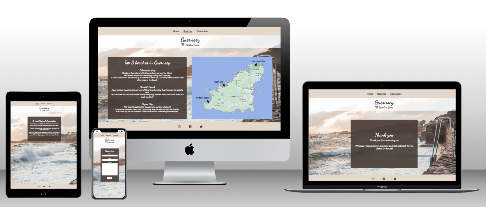
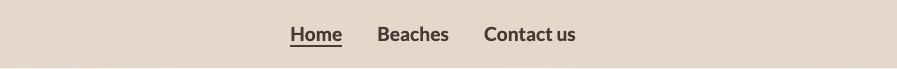
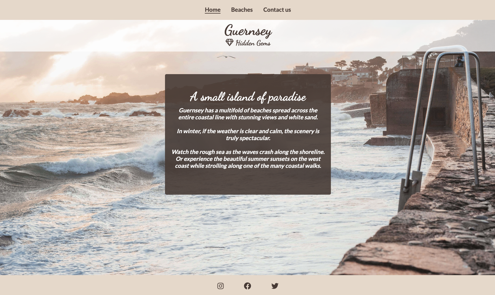
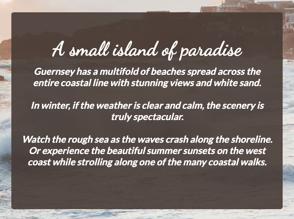
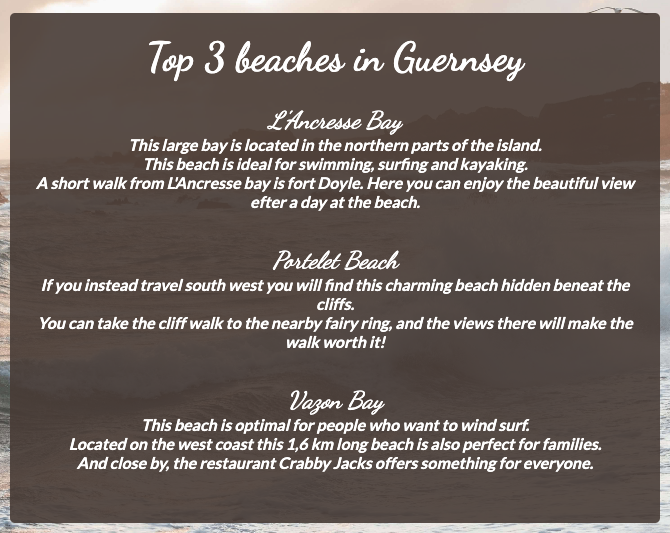
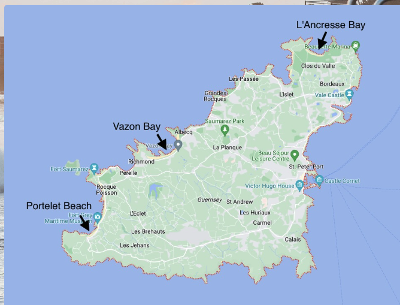
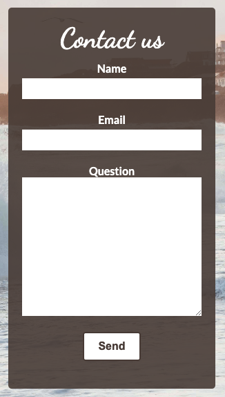
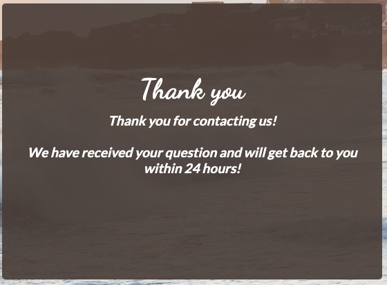
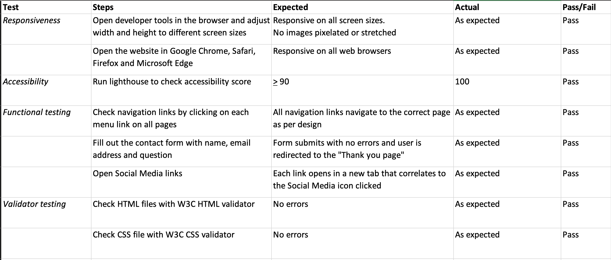

# **Guernsey's Hidden Gems**
## **Description**
This website is for the tourist looking to explore Guernsey and its hidden gems. For anyone who wants to have a peaceful getaway this website provides information about fantastic beaches with amazing views with coastal and cliff walks. 

## **Features**
### *Navigation Bar*
The navigation bar is located on the top of the page and consists of three menu items: Home, Beaches and Contact. When opening the website the user will find her/himself on the home page. From there the user can navigate between the website's different pages using the navigation bar menu items. 
The navigation bar is featured on all pages of the website. It is identical for all pages on the website for easy navigation and consistency. It includes links to Home page, Beaches and Contact and will display which page you are currently on by underlining the page name. This allwos the user to easily navigate between pages. 

### *Logo Bar*
The logo bar consists of the website logo "Guernsey Hidden Gems" displayed next to a small diamond icon. The bar stretches to the full width of the page with the logo centerted in the middle. The logo bar is displayed on all pages underneath the navigation bar to provide consistency throughout the website. The purpose of the logo bar is to ensure that the user easily knows which website they are currently on. 

### *Background image*
The background image shows the waves crashing on the shoreline of Cobo Bay on Guernsey's west coast at sunset. The colors are pastel shades of pink. The background image is displayed on all pages to provide a consistent and cohesive layout. It also captures the beauty of the island to reflect the website's intention. 

### *Home page text section*
The text describes different sceneries the user can experience while visiting Guernsey and its coast line. This text section immediately shows the user the value propositon of the beaches in Guernsey. It is also intened to create an interest to stay and further explore the website. 

### *Footer* 
The footer section is located on the bottom of all pages. The footer section provides icons with links to Guernsey's Hidden gems's Facebook, Twitter and Instagram pages. They open in a new tab when clicked on to not deviate the user away from the website. The intention is to give the user easy acces to Guernsey Hidden Gem's social media platforms where the user can obtain more information and interact in an easier way. 

### *Beaches text section*
This text section provides a short description of the top 3 beaches in Guernsey with location, features and surrounding area for each beach. It communicates the main value of each beach and is indended to attract the user who is looking to potentially visit and explore Guernsey. 

### *Image of map* 
The image displays a map of Guernsey with the three locations of the beaches. This gives the user a clear overview to where the different beaches are located. 

### *Contact Form* 
A contact form is implemented to allow the user to send a question or message about anything related to the information on the website or other inqueries about Guernsey. The contact form consists of three fields which are all required to fill out to be able to submit the form. 
- *Name* 
- *Email* 
- *Question* 
   
The value to the user is to get deeper and more detailed information in an interactive way. 

### *Thank you section* 
This page opens automatically when a contact form is submitted. This gives the user a confirmation that the query is received. A time estimate for when the user can expect a reply is also given, which is a valuable feature. 

### *Features left to implement* 
- An image gallery of the three different beaches 
- A more detailed information section about the different beaches
- Integrated Google maps with the beaches pinned

## **Testing**
 

 ### *Unfixed bugs*
 - When 

## **Deployment**
 ### *Version Control*
The git commands below were used throughout development to push code to the remote repository in GitHub:
- `git add .` - This command was used to add a change in the working directory to the staging area
- `git commit -m "message"` -This command was used to save changes to the local repository. A brief description of what has changed and when.
- `git push` - This command was used to push all commits to the remote repository on GitHub

### *Deployment to Github Pages*
The steps below were followed to deploy the site to GitHub pages:
- In the GitHub repository for hidden-gems-guernsey, navigate to the "Settings" tab
- Under the "Code and automation" section on the left-hand side menu, select "Pages"
-  From the source section drop-down menu, select the "main" branch and click "Save"
- The page will automatically refresh, and a live link will be displayed on the top of the "GitHub Section," indicating a successful deployment

The live link can be found here- https://saramathews.github.io/hidden-gems-guernsey/

### *Clone the Repository from GitHub*
The steps below were followed to clone the repository locally  
- Navigate to the main page of the GitHub Repository you want to clone 
- Above the list of files, click on the drop-down button "<>Code"
- Copy the repository link 
- Open Terminal, type git clone followed by the copied URL, and press enter to create your local clone

## **Credits**
### *Content* 
- The information about the different beaches was given to me by my mother-in-law who lives in Guernsey

- The icons in the footer and logo bar were taken from Font Awesome

- The instructions on how to set up the footer were taken from the Love Running module on Code Institute LMS

- The contact form was made implementing parts of the instructions from the Love Running module on Code Institute LMS.

- The Headings in the Testing report were taken from an example sent to me by my mentor Daisy McGirr

### *Media*
- The background image used was taken from https://unsplash.com/photos/jdllAIKciSM

- The map image is a screenshot of Guernsey, using Google Maps

[def]: docs/testing-hidden-gems-guernsey.png